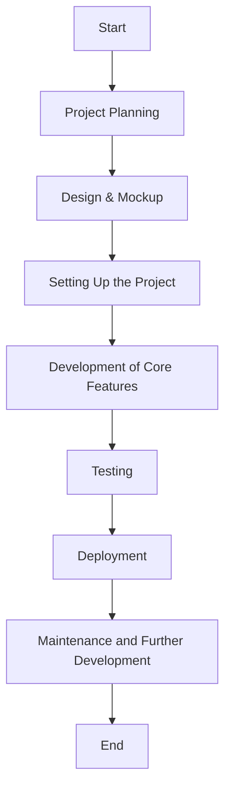
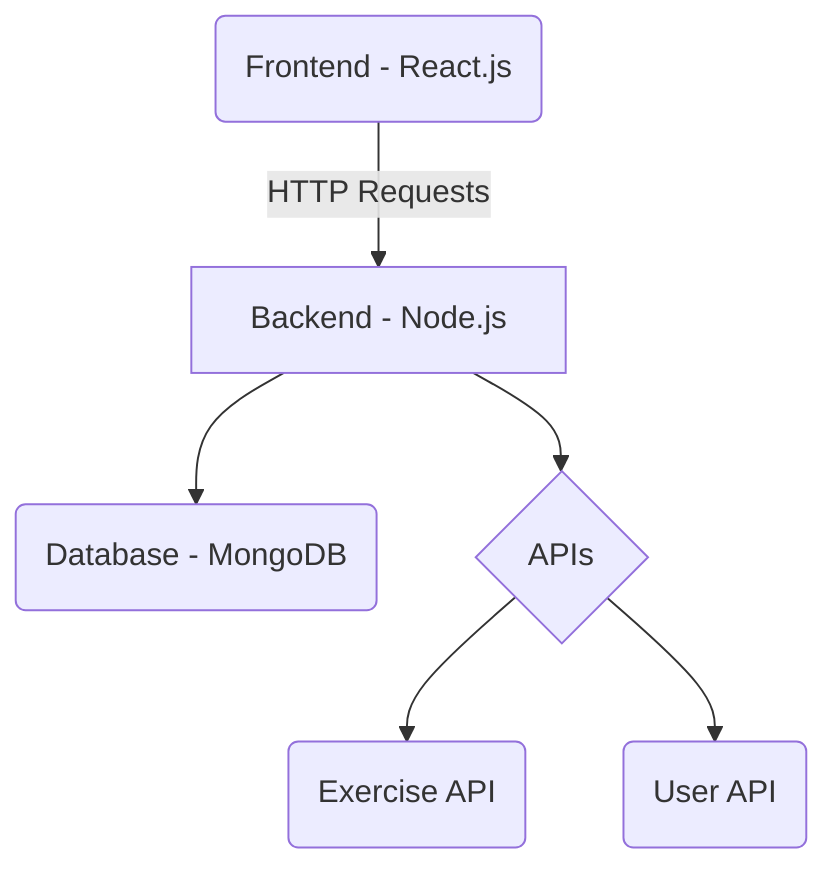
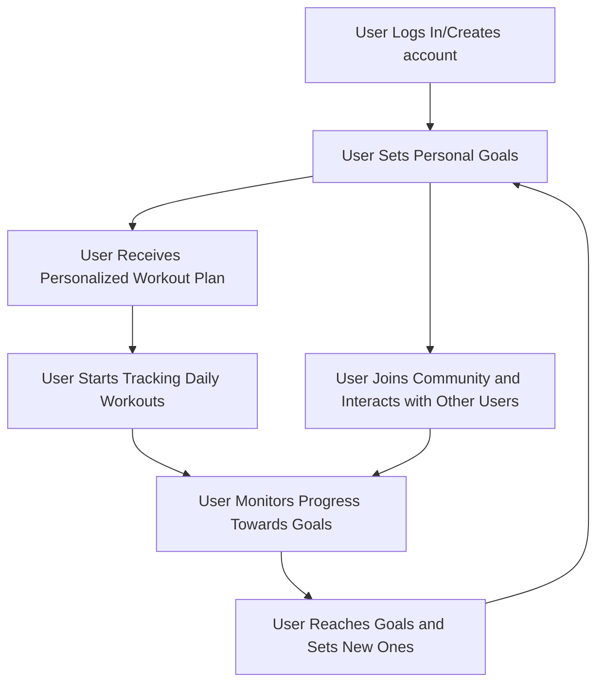
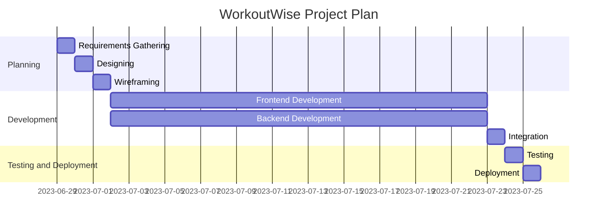

# WorkoutWise: Your Personal Fitness Companion

Welcome to the GitHub repository for WorkoutWise, a comprehensive fitness application designed as a capstone project. This app is designed to make your workout experience more intelligent and goal-oriented, whether you're a beginner or a fitness enthusiast.

## Objectives

The main objectives of WorkoutWise are:

- To provide a personalized workout based on user goals.
- To offer a simple and intuitive interface for tracking daily workouts and generating workout plans.
- To foster a community of fitness enthusiasts who can motivate and learn from each other.
- To leverage technology to make fitness accessible and enjoyable for everyone.

 
## Technologies

WorkoutWise will use the following technologies:

- Frontend: Next.js, React, Typescript, and React bootstrap + CSS for styling.
- Backend: Express.js
- Database: MongoDB for data persistence.
- Others: Git/GitHub for version control, Vercel for deployment.

## Project Planning

## Purpose
The project, WorkoutWise, aims to solve the problem of personalized workout planning for individuals with varying fitness goals and levels. The opportunity lies in providing users with a solution that is tailored to their specific needs, something that generic workout plans often fail to deliver. Currently, individuals must sift through a multitude of generic plans or hire a personal trainer to get a personalized plan. The desired state is to have an easily accessible, personalized workout plan at the user's fingertips.

This problem has been addressed by other projects, but often these solutions lack the level of personalization offered by WorkoutWise or require a subscription.

## Industry/ domain
The domain of this project is Health and Fitness, specifically online fitness training. The current state of the industry is dynamic with challenges from startups and an increasing shift towards online fitness due to global circumstances. The project is also relevant to the wellness and digital health industries.

## Stakeholders
The stakeholders are individuals interested in fitness, specifically those seeking personalized workout plans. This includes fitness beginners, intermediates, and experts. The software is also relevant to health and wellness organizations interested in providing personalized workout plans to their clients. Potentially healthcare professionals helping clients to lose weight or personal trainers looking for inspiration for exercises to show their clients. Stakeholders expect an easy-to-use, efficient, and effective solution for workout planning.

## Product Description
**Architecture Diagram**

## User Stories
| # | User Story Title | User Story Description | Priority |
|---|------------------|------------------------|----------|
| 1 | Account Creation | As a new user, I want to be able to create an account so that I can access personalized workout plans. | High |
| 2 | Goal Setting | As a user, I want to set my fitness goals so that the system can generate a workout plan that aligns with my objectives. | High |
| 3 | Workout Tracking | As a user, I want to track my workouts so that I can monitor my progress over time. | Medium |
| 4 | Discover New Exercises | As a user, I want to discover new exercises so that I can add variety to my workout routine. | Low |
| 5 | Update Profile | As a user, I want to update my profile (including goals and fitness level) so that my workout plan can be adjusted accordingly. | Medium |

## User Flow Diagram

## Wireframe Design

## Open Questions/Out of Scope
Features considered out of scope include nutrition tracking and social networking capabilities. Also integration of smart watches to display more data by using the respective SDK.

## Non-functional Requirements
Security: User login, secure storage of personal details, and data encryption. I have achieved this using bcrypt to hash and store sensitive user information in my database.
The application should be able to handle multiple user requests simultaneously.
The application should be easy to use with a user-friendly interface.
The application should respond quickly to user requests.
The application should have a high degree of reliability.

## Project Planning

## Testing Strategy
Steps taken to achieve product quality included frequent testing during the development process, I was constantly testing throughout the whole process making sure no unexpected errors occurred when changing parts of my application. Using different details, routes, actions etc all to ensure everything was working as expected.
Edge cases were handled by anticipating user errors and providing appropriate error messages, leading to more efficient debugging.

## Implementation
I had to consider whether this was to a mobile-only app or a desktop + mobile application and I started with mobile-only design but decided to do both to make it more accessible, I have deployed with Vercel but obviously, in future I would have to get a domain and use a service like AWS to get to a production level

## End-to-end solution
The software effectively meets its objectives by providing users with personalized workout plans based on their fitness goals and levels and a way to track their workouts.

## References 
[WorkoutWise GitHub Repository](https://github.com/Keegs4213/Workout-Wise)

*Key Resources*:
- Next.js
- React.js
- React-Bootstrap
- Express.js
- MongoDB
- [Exercises API](https://api-ninjas.com/api/exercises)
- Youtube API
