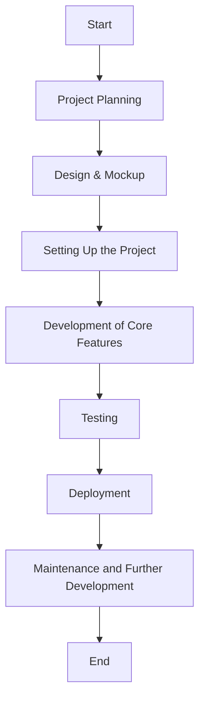
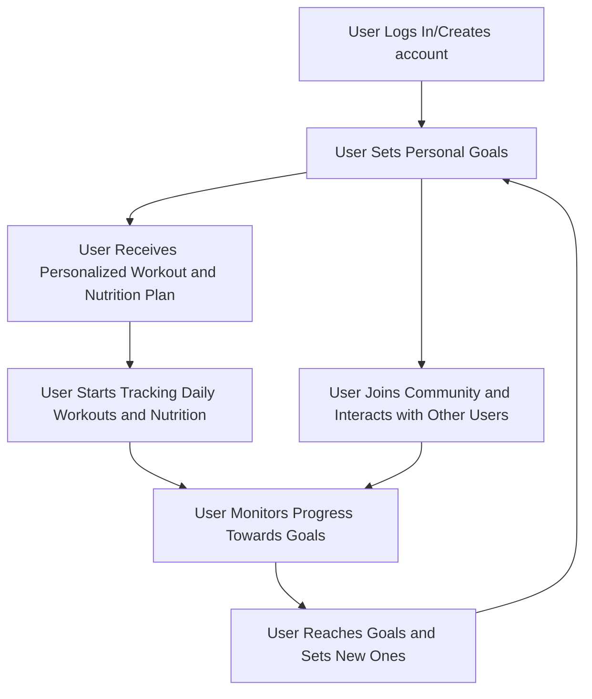

# WorkoutWise: Your Personal Fitness Companion

Welcome to the GitHub repository for WorkoutWise, a comprehensive fitness application designed as a capstone project. This app is designed to make your workout experience more intelligent and goal-oriented, whether you're a beginner or a fitness enthusiast.

## Objectives

The main objectives of WorkoutWise are:

- To provide a personalized workout and nutrition plan based on user goals.
- To offer a simple and intuitive interface for tracking daily workouts and nutrition.
- To foster a community of fitness enthusiasts who can motivate and learn from each other.
- To leverage technology to make fitness accessible and enjoyable for everyone.

 
 ## Technologies

WorkoutWise will use the following technologies:

- Frontend: Next.js, React, Typescript, and CSS for styling.
- Backend: Next.js for API routes
- Database: MongoDB for data persistence.
- Others: Git/GitHub for version control, Vercel for deployment.

**8. User Flow Diagram**

