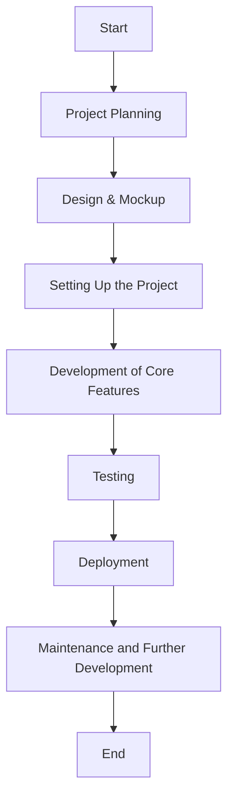
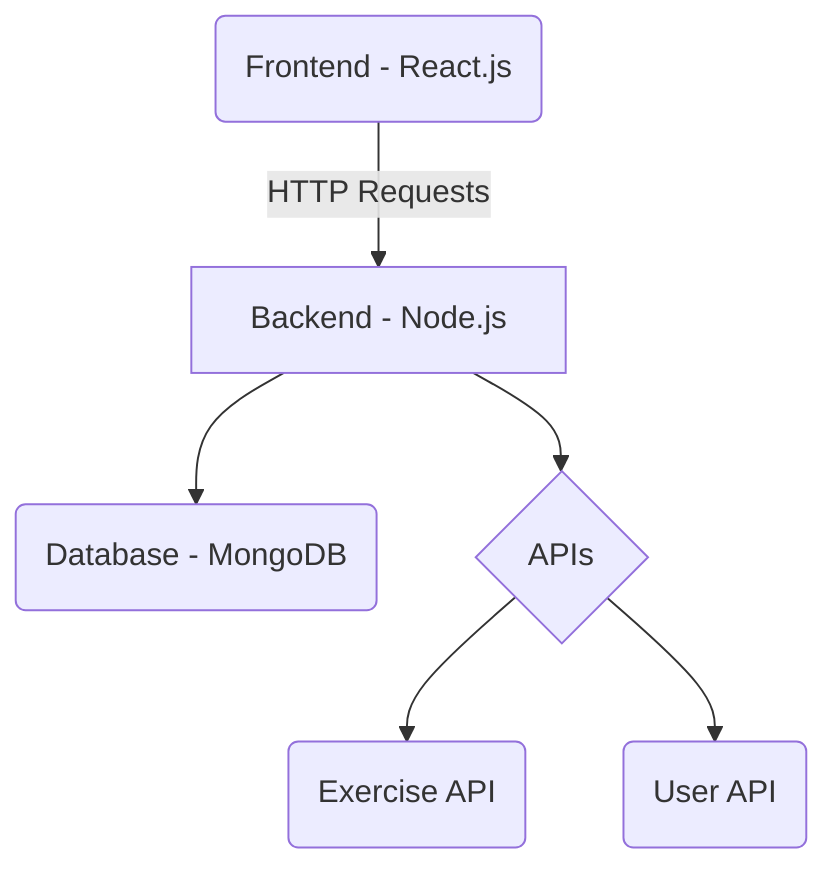
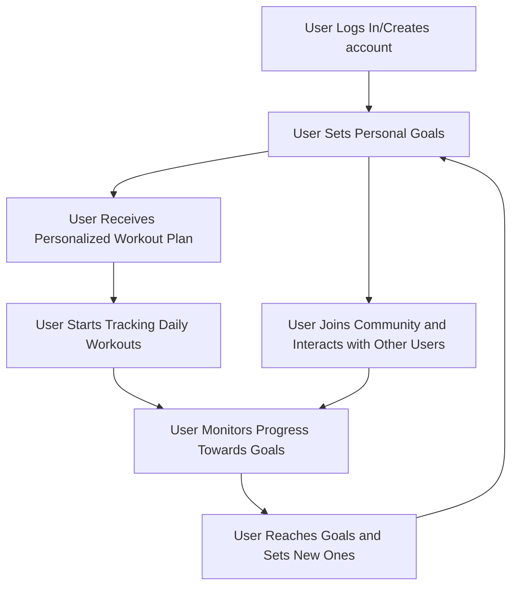
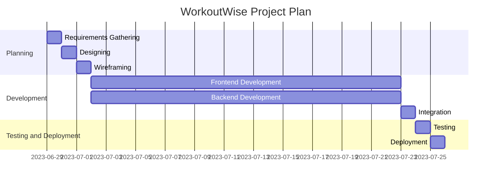

# WorkoutWise: Your Personal Fitness Companion

Welcome to the GitHub repository for WorkoutWise, a comprehensive fitness application designed as a capstone project. This app is designed to make your workout experience more intelligent and goal-oriented, whether you're a beginner or a fitness enthusiast.

## Objectives

The main objectives of WorkoutWise are:

- To provide a personalized workout based on user goals.
- To offer a simple and intuitive interface for tracking daily workouts and generating workout plans.
- To foster a community of fitness enthusiasts who can motivate and learn from each other.
- To leverage technology to make fitness accessible and enjoyable for everyone.

 
## Technologies

WorkoutWise will use the following technologies:

- Frontend: Next.js, React, Typescript, and React bootstrap + CSS for styling.
- Backend: Express.js
- Database: MongoDB for data persistence.
- Others: Git/GitHub for version control, Vercel for deployment.

## Project Planning

## Purpose
WorkoutWise aims to address the problem of personalized workout planning for individuals with varying fitness goals and levels. We see an opportunity in offering users a solution tailored to their specific needs, a characteristic that generic workout plans often lack. Currently, individuals need to sift through numerous generic plans or hire a personal trainer to receive a personalized plan. We envision a future where an easily accessible, personalized workout plan lies at every user's fingertips.

Other projects have attempted to address this problem, but they often lack the level of personalization that WorkoutWise offers or require a subscription.

## Industry/ domain
WorkoutWise operates within the Health and Fitness domain, specifically focusing on online fitness training. The industry is currently dynamic, facing challenges from startups and an increasing shift towards online fitness due to global circumstances. Our project also holds relevance to the wellness and digital health industries.

## Stakeholders
Stakeholders for WorkoutWise are individuals interested in fitness, especially those seeking personalized workout plans. This includes fitness beginners, intermediates, and experts. The software also interests health and wellness organizations that aim to offer personalized workout plans to their clients. Healthcare professionals assisting clients with weight loss or personal trainers seeking inspiration for exercises to demonstrate to their clients may find value in our software. Stakeholders anticipate an easy-to-use, efficient, and effective solution for workout planning.

## Product Description
**Architecture Diagram**

## User Stories
| # | User Story Title | User Story Description | Priority |
|---|------------------|------------------------|----------|
| 1 | Account Creation | As a new user, I want to be able to create an account so that I can access personalized workout plans. | High |
| 2 | Goal Setting | As a user, I want to set my fitness goals so that the system can generate a workout plan that aligns with my objectives. | High |
| 3 | Workout Tracking | As a user, I want to track my workouts so that I can monitor my progress over time. | Medium |
| 4 | Discover New Exercises | As a user, I want to discover new exercises so that I can add variety to my workout routine. | Low |
| 5 | Update Profile | As a user, I want to update my profile (including goals and fitness level) so that my workout plan can be adjusted accordingly. | Medium |

## User Flow Diagram

## Wireframe Design

## Open Questions/Out of Scope
We consider features such as nutrition tracking and social networking capabilities to be out of scope. Integration of smartwatches to display more data using their respective SDK also falls outside the scope of this project.

## Non-functional Requirements
For security, we have implemented user login, secure storage of personal details, and data encryption. We achieved this using bcrypt to hash and store sensitive user information in our database. The application can handle multiple user requests simultaneously, offers a user-friendly interface, responds quickly to user requests, and exhibits a high degree of reliability.

## Project Planning

## Testing Strategy
We ensured product quality through frequent testing during the development process. We constantly tested all aspects of the application throughout the entire process to ensure that no unexpected errors occurred when making changes. We handled edge cases by anticipating user errors and providing appropriate error messages, which led to more efficient debugging.

## Implementation
We initially considered making this a mobile-only app but decided to support both desktop and mobile platforms to make it more accessible. We have deployed the application with Vercel, but in the future, we plan to acquire a domain and use a service like AWS for production-level deployment.

## End-to-end solution
The software effectively meets its objectives by providing users with personalized workout plans based on their fitness goals and levels and a way to track their workouts.

## References 
[WorkoutWise GitHub Repository](https://github.com/Keegs4213/Workout-Wise)

*Key Resources*:
- Next.js
- React.js
- React-Bootstrap
- Express.js
- MongoDB
- [Exercises API](https://api-ninjas.com/api/exercises)
- [Youtube API](https://developers.google.com/youtube/v3)
