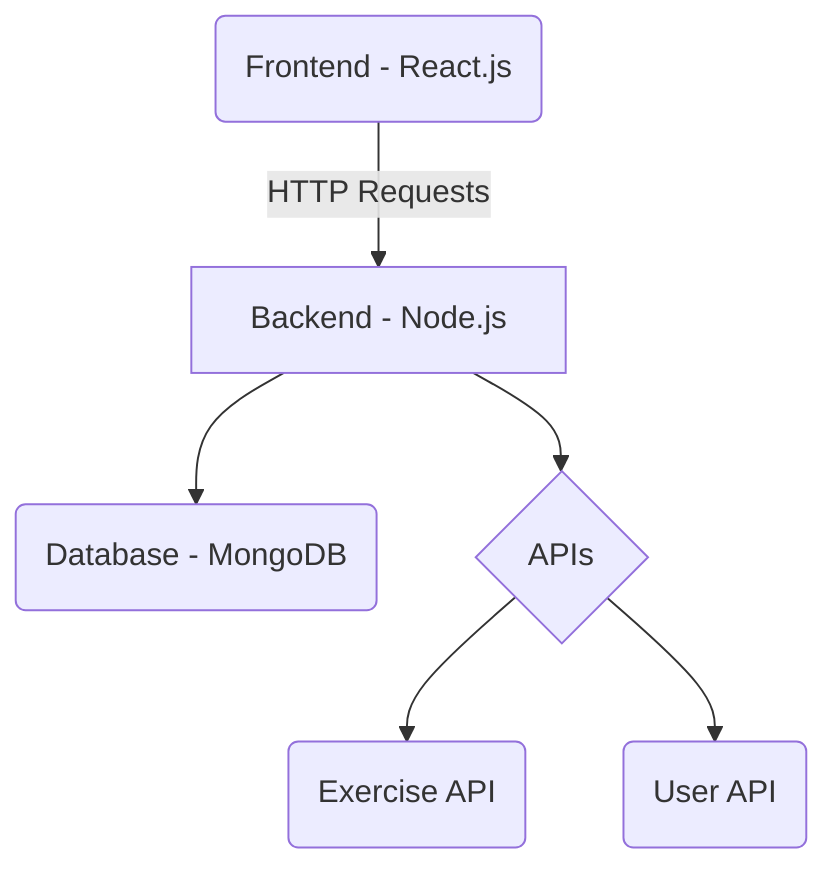
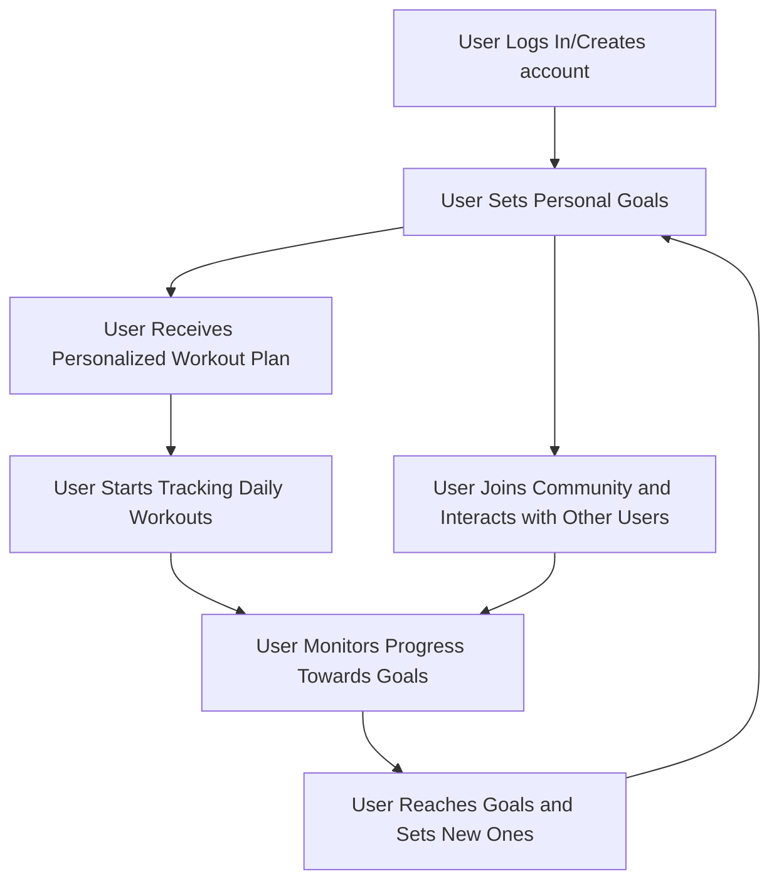
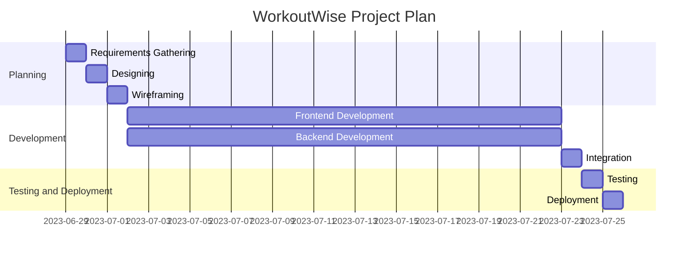

# WorkoutWise: Your Personal Fitness Companion

Welcome to the GitHub repository for WorkoutWise, a comprehensive fitness application designed as a capstone project. This app is designed to make your workout experience more intelligent and personalised towards the user's fitness goals, whether you're a beginner or a fitness expert.

## Purpose

This project explores the potential of creating a workout companion app that acknowledges the need for personalization in fitness regimes, recognizing that there isn't a single path to achieving fitness goals. WorkoutWise aims to address this gap in the market by providing personalized workout plans and workout tracking based on the user's goals and experience level.

This problem is valuable as it goes beyond the standard "one-size-fits-all" approach found in many fitness apps. In the current state, users often find themselves following fitness and nutrition plans that do not consider their individual differences or preferences, which can lead to demotivation and unmet goals. WorkoutWise, on the other hand, aims to provide a more tailored approach that may increase user engagement and the achievement of fitness goals.

Currently, individuals need to sift through numerous generic plans or hire a personal trainer to receive a personalized plan. We envision a future where an easily accessible, personalized workout plan lies at every user's fingertips.

Other projects have attempted to address this problem, but they often lack the level of personalization that WorkoutWise offers or require a subscription.

## Industry/ domain
WorkoutWise operates at the crossroads of Health and Fitness, with a particular emphasis on online fitness training. The industry landscape is extremely dynamic, with challenges emerging from innovative startups and a pronounced shift towards digital fitness solutions, prompted by the prevailing global circumstances.

This project holds relevance not only to the fitness industry but also extends its value to the wellness and digital health sectors. The industry's value chain is diverse, encompassing fitness enthusiasts, personal trainers, nutritionists, and software developers. This project could also be relevant to other industries where personal goal tracking and community support are beneficial.

## Stakeholders
Stakeholders for WorkoutWise are individuals interested in fitness, especially those seeking personalized workout plans. This includes all experience levels ranging from fitness beginners to intermediates, and experts. The software also interests health and wellness organizations that aim to offer personalized workout plans to their clients.

Healthcare professionals assisting clients with weight loss or personal trainers seeking inspiration for exercises to demonstrate to their clients may find value in our software. Stakeholders anticipate an easy-to-use, efficient, and effective solution for workout planning.

## Product Description
**Architecture Diagram**

## User Stories
| # | User Story Title | User Story Description | Priority |
|---|------------------|------------------------|----------|
| 1 | Account Creation | As a new user, I want to be able to create an account so that I can access personalized workout plans. | High |
| 2 | Goal Setting | As a user, I want to set my fitness goals so that the system can generate a workout plan that aligns with my objectives. | High |
| 3 | Workout Tracking | As a user, I want to track my workouts so that I can monitor my progress over time. | Medium |
| 4 | Discover New Exercises | As a user, I want to discover new exercises so that I can add variety to my workout routine. | Low |
| 5 | Update Profile | As a user, I want to update my profile (including goals and fitness level) so that my workout plan can be adjusted accordingly. | Medium |

## User Flow Diagram

## Wireframe Design

## Open Questions/Out of Scope
We consider features such as nutrition tracking and social networking capabilities to be out of scope. Integration of smartwatches to display more data using their respective SDK also falls outside the scope of this project.

## Non-functional Requirements
For security, we have implemented user login, secure storage of personal details, and data encryption. We achieved this using bcrypt to hash and store sensitive user information in our database. The application can handle multiple user requests simultaneously, offers a user-friendly interface, responds quickly to user requests, and exhibits a high degree of reliability.

## Project Planning

## Testing Strategy
We ensured product quality through frequent testing during the development process. We constantly tested all aspects of the application throughout the entire process to ensure that no unexpected errors occurred when making changes. We handled edge cases by anticipating user errors and providing appropriate error messages, which led to more efficient debugging.

## Implementation
We initially considered making this a mobile-only app but decided to support both desktop and mobile platforms to make it more accessible. We have deployed the front-end application with Vercel and originally deployed the backend using AWS elastic beanstalk but the cost was too much so have switched backend hosting to Heroku. To access the application please visit: https://workout-wise-kg.vercel.app/ 
Please note, Heroku sleeps the backend when not in use to reduce cost so first time you login/signup it may take a while to load as it is waking the backend.

## End-to-end solution
The software effectively meets its objectives by providing users with personalized workout plans based on their fitness goals and levels and a way to track their workouts.

## References 
[WorkoutWise GitHub Repository](https://github.com/Keegs4213/Workout-Wise)
[WorkoutWise Live Deployment](https://workout-wise-kg.vercel.app/)

*Key Resources*:
- Next.js
- React.js
- React-Bootstrap
- Express.js
- MongoDB
- [Exercises API](https://api-ninjas.com/api/exercises)
- [Youtube API](https://developers.google.com/youtube/v3)

## Installing and running the project
The project is deployed locally at the moment, all that is required is to clone the project to your local system, run npm install and npm run proj (uses concurrently to run both front end + backend). This will change in future when the project has been properly deployed
